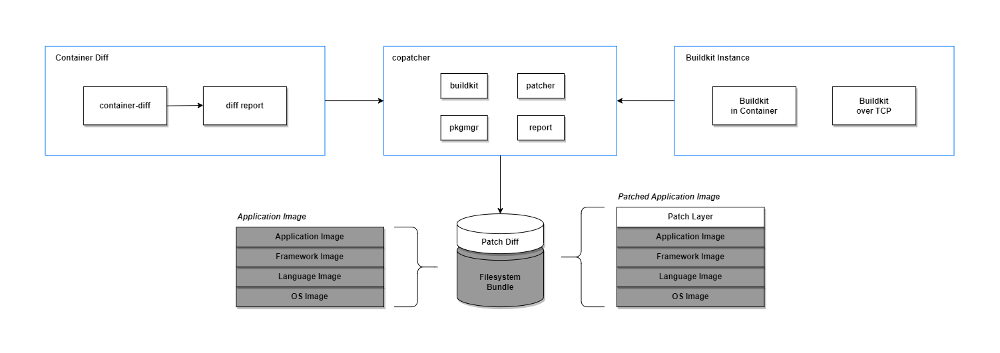

# copatcher

[](https://github.com/craftslab/copatcher/actions?query=workflow%3Aci)
[](https://codecov.io/gh/craftslab/copatcher)
[](https://goreportcard.com/report/github.com/craftslab/copatcher)
[](https://github.com/craftslab/copatcher/blob/main/LICENSE)
[](https://github.com/craftslab/copatcher/tags)


## Introduction

*copatcher* is a container patcher written in Go.


## Prerequisites

- Go >= 1.18.0


## Install

```bash
# container-diff
curl -LO https://storage.googleapis.com/container-diff/latest/container-diff-linux-amd64
sudo install container-diff-linux-amd64 /usr/local/bin/container-diff

# buildkit
docker pull moby/buildkit:latest
```


## Run

```bash
# container-diff
docker commit -m "Create new image from container's changes" \
  ubuntu-22.04-container ubuntu:22.04-updated
container-diff diff --type=apt --type=node --type=pip --json \
  daemon://ubuntu:22.04 daemon://ubuntu:22.04-updated > report.json

# buildkit
docker run --detach --rm --privileged --name buildkitd \
  --entrypoint buildkitd moby/buildkit:latest
# OR
docker run --detach --rm --privileged -p 127.0.0.1:8888:8888/tcp --name buildkitd \
  --entrypoint buildkitd moby/buildkit:latest --addr tcp://0.0.0.0:8888

# copatcher
version=latest make build
./bin/copatcher --image ubuntu:22.04 --report report.json --tag 22.04-patched --timeout "5m" \
  --addr "docker-container://buildkitd" --ignore-errors
# OR
./bin/copatcher --image ubuntu:22.04 --report report.json --tag 22.04-patched --timeout "5m" \
  --addr "tcp://0.0.0.0:8888" --ignore-errors
```


## Docker

```bash
version=latest make docker
docker run ghcr.io/craftslab/copatcher:latest [options]
```


## Usage

```
usage: copatcher --image=IMAGE --report=REPORT --tag=TAG [<flags>]

Container patcher


Flags:
  --[no-]help           Show context-sensitive help (also try --help-long and --help-man).
  --[no-]version        Show application version.
  --addr="unix:///run/buildkit/buildkitd.sock"
                        Address of buildkitd service
  --[no-]ignore-errors  Ignore errors and continue patching
  --image=IMAGE         Application image name and tag to patch
  --report=REPORT       Report file generated by container-diff
  --tag=TAG             Tag for the patched image
  --timeout="5m"        Timeout for the operation
```


## Design




## License

Project License can be found [here](LICENSE).


## Reference

- [container-diff](https://github.com/GoogleContainerTools/container-diff)
- [copacetic](https://project-copacetic.github.io/copacetic/website/)
- [dockerfile-generator](https://www.startwithdocker.com/)
